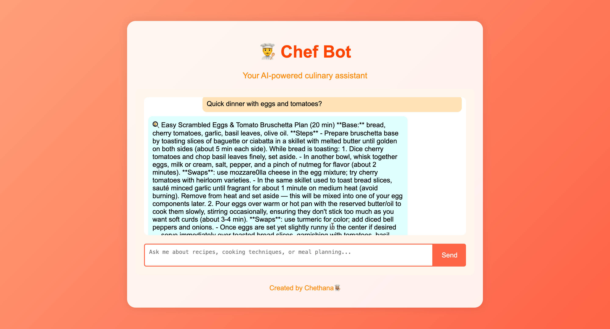

<div align="center">
  <h1>🍳 Chef CTS</h1>
  <p><strong>LLM-powered culinary assistant built with FastAPI + Ollama (Llama 3.1 8B) + RAG</strong></p>
  
  
  
  
</div>

---

## Overview
Chef CTS is a local, privacy-first **AI chef assistant** that:
- Runs **completely offline** using the open-source **Llama 3.1 8B** model via **Ollama**
- Uses **Retrieval-Augmented Generation (RAG)** over a curated culinary knowledge base  
- Provides **recipes, substitutions, conversions, disaster fixes, and history** in a playful, precise style  
- Combines a lightweight **HTML + CSS + JS** chat frontend with a **FastAPI** backend

---

## Architecture
Frontend (HTML + JS) → FastAPI backend → RAG module (FAISS + embeddings)
↳ Ollama (Llama 3.1 8B) local model

**Technologies**
| Layer | Stack |
|-------|--------|
| UI | HTML 5, CSS 3, Vanilla JS |
| API | FastAPI (Uvicorn) |
| LLM Runtime | Ollama (Llama 3.1 8B Instruct) |
| Retrieval | FAISS + SentenceTransformers |
| Data | Markdown + PDF culinary knowledge base |

---

## Quick Start (100 % local)
```bash
# 1️⃣ Start Ollama service
ollama serve
ollama pull llama3.1:8b-instruct-q4_K_M     # or smaller model

# 2️⃣ Create & activate Python env
cd backend
python3 -m venv .venv
source .venv/bin/activate
pip install -r requirements.txt

# 3️⃣ Build knowledge index
python ingest.py

# 4️⃣ Run FastAPI backend
python app.py     # → http://127.0.0.1:8000

# 5️⃣ Serve frontend
cd ..
python -m http.server 5500
# open http://127.0.0.1:5500/index.html

```
---
## Knowledge Base (backend/knowledge/)
| File                                | Purpose                                   |
| ----------------------------------- | ----------------------------------------- |
| `chef_notes.md`                     | substitutions, conversions, safety, fixes |
| `quick_recipes.md`                  | 20–40 min meal ideas, pantry swaps        |
| `cooking_temperatures.pdf`          | USDA-verified temperature chart           |
| `conversions_and_substitutions.pdf` | measurement & ingredient references       |

Run python ingest.py anytime you update these files to rebuild the FAISS index.

---

## Core Features

✅ Offline LLM Inference (no API keys)

✅ Retrieval-Augmented Generation over custom recipes

✅ Conversation memory per thread (JSON-based)

✅ Friendly Chef persona system prompt

✅ Optional streaming for live token output

---

## Model Benchmark & Comparison

Chef CTS was evaluated across several open-source LLMs available through Ollama to find the ideal balance of speed, quality, and resource efficiency for local, offline performance.
All tests were performed on a MacBook Air (M1, 16 GB RAM) with identical Chef CTS prompts.

| Model Variant             | Size          | Avg. Response Time (sec) | RAM Usage (GB) | Output Quality (1–5) | Notes                                                                                          |
| ------------------------- | ------------- | ------------------------ | -------------- | -------------------- | ---------------------------------------------------------------------------------------------- |
| **Llama 2 7B**            | 7 B           | 37 s                     | ~6.5 GB        | ⭐⭐⭐                  | Solid reasoning but slower and less conversational; overkill for simple culinary queries.      |
| **Mistral 7B**            | 7 B           | 31 s                     | ~7 GB          | ⭐⭐⭐⭐                 | Smooth language and better structure, but still heavy for local, real-time responses.          |
| **Phi 3 Mini**            | 3.8 B         | **14 s**                 | **~3.2 GB**    | ⭐⭐⭐⭐                 | ⚡ Fastest model tested; small footprint, consistent culinary reasoning, ideal for laptop CPUs. |
| **Llama 3 8B (Instruct)** | 8 B           | 25 s                     | ~7.8 GB        | ⭐⭐⭐⭐⭐                | High-quality text but double the response latency; too resource-intensive for daily use.       |
| **Llama 3.1 8B (q4_K_M)** | 8 B quantized | 19 s                     | ~4 GB          | ⭐⭐⭐⭐                 | Faster than full 8B; excellent output but still heavier than Phi 3 Mini.                       |

### Final Choice: Phi 3 Mini

After iterative testing, Phi 3 Mini was selected as the production model for Chef CTS.
It delivers near-Llama-3-level output quality while maintaining:

✅ Sub-15 second average response time (on an M1 MacBook Air)

✅ Low memory usage (~3 GB), suitable for lightweight local inference

✅ Stable behavior with Ollama’s REST API

---

## Example Conversation

User: “What can I cook with tomatoes, eggs, and cheese?”
Chef CTS:
Try a tomato-cheese frittata! Sauté garlic + tomatoes, add whisked eggs, top with cheese, and bake 10–12 min at 375 °F (190 °C) until puffed. Serve warm.

---

## Live Demo

Here’s a glimpse of **Chef CTS** in action:

<div align="center">
  
  <p><em>Chef CTS suggesting recipes and fixing cooking disasters — all offline!</em></p>
</div>

---

## Connect
**Chethana T. Shantha Kumar**

[chethana1681@gmail.com](mailto:chethana1681@gmail.com)  
[LinkedIn](https://www.linkedin.com/in/chethanats/)  
[Portfolio / Website](https://chethants.fyi)

